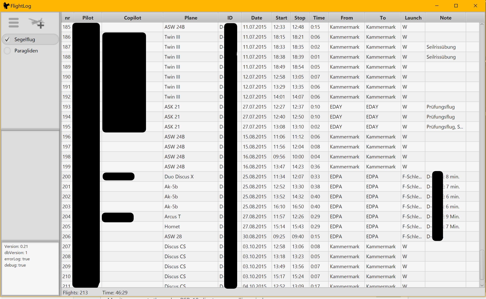
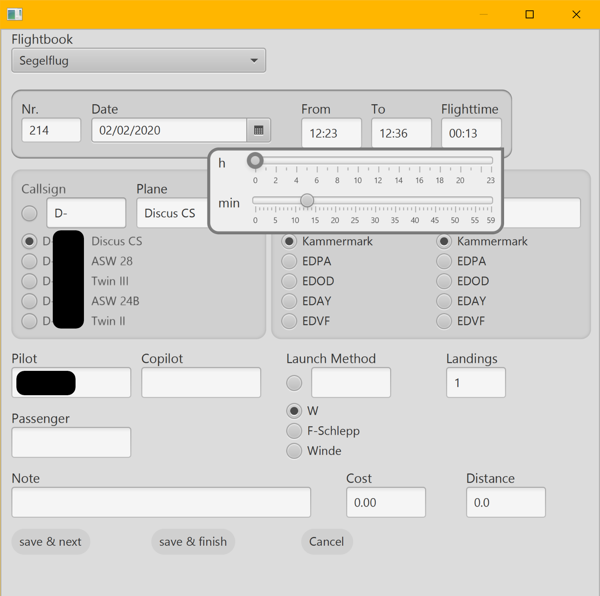

# java-flight-logbook
This is a java FX project which implements a flight logbook. I tried to make the input form for new flights as time saving as possible and also included an adaptable (column order and names) csv import.

## screenshots

## install
copy sqlite-jdbc-3.8.7.jar to lib folder